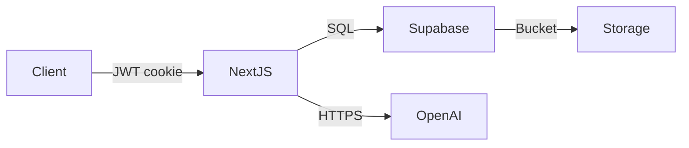

# Mila Next JS • Architecture Guide

> Historical architecture snapshot. Follow [current project instructions](../PROJECT_INSTRUCTIONS.md) and the tracked code for current runtime, API, auth, schema, and checks. Do not apply example policies or assume the old test frameworks exist.

> Historical design snapshot; not current operating instructions.

---

## 1. High‑Level Overview

| Layer | Technology | Purpose |
|-------|------------|---------|
| **Frontend** | **Next.js 15** (App Router) • **React 19** | Server/Client components, edge streaming |
| **Backend‑for‑Frontend** | **Next.js Route Handlers** | Auth, Graph coordination, OpenAI proxy |
| **Core Data** | **Supabase** (Postgres + Auth + Storage) | Content, milestones, media, access control |
| **AI Services** | **OpenAI Assistants & TTS** | Chat bot & blog audio |
| **Observability** | Vercel Analytics • Google GA4 | Usage and performance metrics |



---

## 2. Frontend Anatomy

```bash
src/
├─ app/                 # App Router root
│  ├─ (protected)/      # Auth‑gated pages
│  ├─ (public)/         # Public landing & marketing
│  └─ api/              # Route handlers (edge)
├─ components/          # Shared React components
├─ lib/                 # Cross‑cutting helpers
├─ types/               # Zod / TS models
└─ utils/               # Client + server utilities
```

*Route groups* leverage Next 15 conventions for clean RBAC:

```
/src/app/(protected)/blog/…      – Requires Google OAuth
/src/app/(public)/about          – Always public
```

---

## 3. Database Model (Supabase)

``` mermaid
erDiagram
  blogs ||--o{ blog_audio : caches }
  blogs ||--o{ blog_tags  : tagged }
  journey_cards {
      id uuid PK
      journey_type text
      title text
      message text
      event_date date
      created_by uuid FK users.id
  }
  chat_threads ||--o{ chat_messages : contains }
```

| Table | Highlight |
|-------|-----------|
| **blogs** | Rich‑text post; owner = `created_by` |
| **blog_audio** | pk=`slug`, binary mp3, `created_at` |
| **journey_cards** | Milestones (first‑year, one‑year…) |
| **chat_threads / messages** | Persisted assistant context |

### Row‑Level Security example

```sql
-- Only allow owners to read / write their journey cards
create policy "Journey owners" on journey_cards
using (created_by = auth.uid())
with check (created_by = auth.uid());
```

---

## 4. API Surface (OpenAPI 3.1)

| Path | Verb | Auth | Summary |
|------|------|------|---------|
| `/api/chat` | POST | 🔒 | Create / continue chat thread |
| `/api/poll-chat-status` | POST | 🔒 | Poll assistant run |
| `/api/blog/{slug}/audio` | GET | 🔒 | Stream or cache TTS mp3 |

Full contract: [`docs/openapi.yaml`](../openapi.yaml)  
Tool manifest: [`mcp.json`](../mcp.json)

---

## 5. Data Flows

```
(1) Authentication
Browser → Google OAuth → Supabase Session → JWT cookie → Protected pages

(2) Blog‑Audio
Client → /api/blog/{slug}/audio →
  [if cache miss] → OpenAI TTS → Supabase.storage.insert() → Stream
  [else]           → Supabase.storage.get()  → Stream

(3) Chat
Client → /api/chat → Assistants API → Store thread/msg → SSE stream back
```

---

## 6. Development Patterns

| Concern | Approach |
|---------|----------|
| **State** | React hooks for UI, server actions for mutations |
| **Errors** | `error.tsx` boundaries + typed Error payloads |
| **Performance** | Image optimization, HTTP caching, edge streaming |
| **Testing** | Playwright e2e • Vitest for utils • PostgREST fixtures |

---

## 7. Environment Variables

| Variable | Scope | Required | Notes |
|----------|-------|----------|-------|
| `NEXT_PUBLIC_SUPABASE_URL` | Client | ✔ | Project URL |
| `NEXT_PUBLIC_SUPABASE_ANON_KEY` | Client | ✔ | Public anon key |
| `SUPABASE_SERVICE_ROLE_KEY` | Server | ‑ | Only migrations / RLS tests |
| `OPENAI_API_KEY` | Server | ✔ | Chat + TTS |
| `NEXT_PUBLIC_SITE_URL` | Client | ✔ | OAuth redirect base |
| `NEXT_PUBLIC_ADMIN_EMAIL` | Client | ✔ | Admin-only features (e.g., create blog) |

Copy template: `cp .env.example .env.local`.

---

## 8. Schema Docs

* **OpenAPI spec** – [`/docs/openapi.yaml`](../docs/openapi.yaml)  
* **MCP manifest** – [`/mcp.json`](../mcp.json)  
* **JSON Schemas** – [`/docs/schemas`](../docs/schemas) (`blog.schema.json`, `journey.schema.json`, …)

---

## 9. Deployment & CI/CD

```text
 ┌─ Push / PR
 │
 │  1. GitHub Actions: lint → type‑check → openapi‑lint
 │  2. Supabase CLI: run migrations on shadow db
 │  3. Vercel build (edge) → preview URL
 │  4. Playwright smoke tests against preview
 └─ Merge → Auto‑promote to prod (.milagates.com)
```

* **Edge Functions** for low‑latency TTS streaming<br>
* **Analytics** auto‑enabled via Vercel + GA4<br>
* Env vars managed per‑environment in **Vercel Dashboard**.

---

## 10. Glossary

| Term | Meaning |
|------|---------|
| **Journey Card** | A milestone entry (e.g., "First Steps") displayed on timeline |
| **Thread / Run** | OpenAI Assistants vocabulary: a *thread* holds messages; a *run* is an inference execution |
| **Protected Route** | Any page under `(protected)` that requires Google OAuth |

---

### Last updated → May 9 2025 